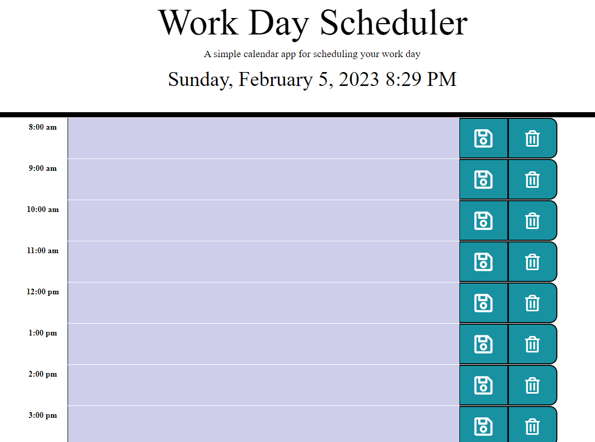

# Module 5 Project: Workday Scheduler

## Description

A simple calendar application that allows a user to save events for each hour of the day was created by modifying starter code.  This app runs in the browser and features dynamically updated HTML and CSS powered by jQuery.
## Installation

N/A we don’t have any steps to take to install anything for our webpage.

## Usage
User can utilize app as a daily planner to create a schedule.

The current day is displayed at the top of the calendar, and user is presented with timeblocks for standard business hours.

Timeblocks are color coded to indicate whether it is in the past, present, or future.

User can enter an event by clicking on the timeblock, and save the event by clicking the save button. Refreshing the page also saves the event inputed. 

Revision and editing of the script.js file renders the following webpage:

 
 
## Credits
Many Thanks to the UCR Coding Bootcamp Academic team and my wonderful classmates for supporting me through my coding journey!

## License
N/A

## Link to deployed application: 
https://anacampos171.github.io/work-day-scheduler/

